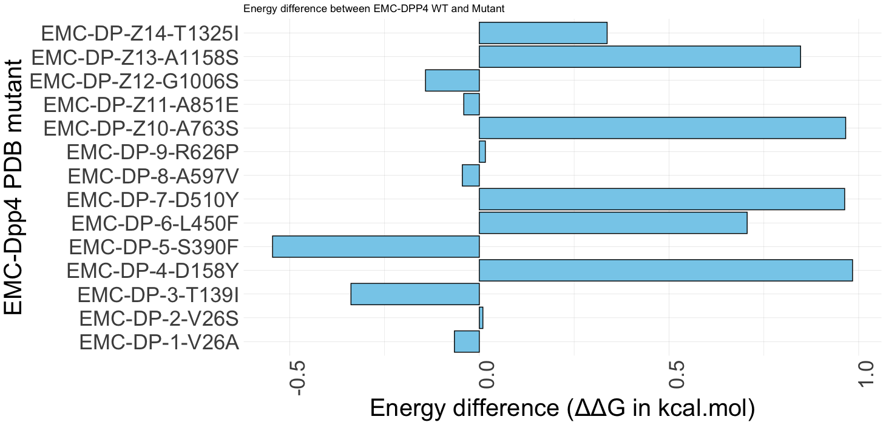

# Operation-Burat
An in-silico modelling pipeline to understand the effects of MERS-CoV Spike glycoprotein mutants on the interaction with the host receptor DPP4. Burat is a special location to me. Found in Kenya, I detected  most of Kenya MERS-CoV viruses from camels during my PhD.

This repository provides a streamlined workflow for predicting and analyzing the interactions between the MERS-CoV Spike protein and DPP4 receptor using cutting-edge computational tools such as AlphaFold, PyMOL, and FoldX. The pipeline includes detailed steps to predict protein structures, inspect and manipulate them, and evaluate the impact of mutations on binding affinity. This pipeline has been developed and tested on MERS-CoV Spike glycoprotein (the prototypic EMC/2012) and human DPP4. The pipeline uses different tools (currently working on a snakemake/nextflow workflow manager 😅)

## Overview

### Key Tools and Steps
1. **AlphaFold**: Prediction of Spike-DPP4 interaction. ([https://alphafoldserver.com/])
2. **PyMOL**: Structural inspection and preparation. ([https://www.pymol.org/])
3. **FoldX**: Protein repair, mutation analysis, and binding energy calculation. ([https://foldxsuite.crg.eu/])

---

## Pipeline Steps

### Step 1: AlphaFold
**Prediction of Spike-DPP4 Interaction**
- **Resource**: [AlphaFold Training Guide](https://www.ebi.ac.uk/training/online/courses/alphafold/an-introductory-guide-to-its-strengths-and-limitations/strengths-and-limitations-of-alphafold/)

#### Key Considerations:
- Do not draw conclusions about Post-Translational Modification (PTM) scores from AlphaFold when comparing wild-type structures and amino acid variants.
- Inclusion criterion:
  - **pTM Score > 0.5**: Indicates that the predicted fold might resemble the true structure.
  - Ignore ipTM values as corrections are made in subsequent steps.

#### Notes:
- Ensure input sequence files are consistent across all analyses.
- The order of input files in AlphaFold matters.

### Step 2: PyMOL
**Structural Inspection and Preparation**
1. Import the primary model (model_0).
2. Inspect the generated structure for anomalies or issues.
3. Save the structure in `.pdb` format for further analysis.

### Step 3: FoldX
**Repair and Analyze the Protein Complex**

#### Step 3.1: Install FoldX
1. Download FoldX from the official [FoldX website](https://foldx.crg.eu/).
2. Install FoldX and make the executable accessible via your system’s PATH.
3. Add execution permissions using:
   ```bash
   chmod +x foldx5_1
   ```

#### Step 3.2: Prepare the Complex for FoldX Analysis
1. Load the Spike-DPP4 complex PDB file (e.g., `spike_505Y_dpp4_complex.pdb`).
2. Repair the PDB file:
   ```bash
   FoldX --command=RepairPDB --pdb=spike_505Y_dpp4_complex.pdb
   ```
   - Output: A repaired PDB file (e.g., `spike_505Y_dpp4_complex_Repair.pdb`).

- The repair function of FoldX reduces the energy content of a protein-structure model to a minimum by rearranging side chains

#### Step 3.3: Generate and Analyze Mutations
1. Create a mutation list:
   - Format: `WTresidue:ChainResidue:Number:NewResidue`
   - Example for mutating residue 505 on chain A to Tyrosine:
     ```
     DA505Y
     ```
2. Save the mutation list as `individual_list.txt`.
3. Run mutation analysis:
   ```bash
   FoldX --command=BuildModel --pdb=spike_505Y_dpp4_complex_Repair.pdb --mutant-file=individual_list.txt --numberOfRuns=5
   ```
   - This generates structural models for each mutation and calculates changes in Gibbs free energy (ΔΔG). The function BuildModel introduces mutations and optimizes the structure of the new protein variant. The energy function of FoldX is only able to calculate the energy difference in accurate manner between the wildtype and a variant of the protein 

#### Step 3.4: Interpret FoldX Output
1. Check the results file (e.g., `spike_505Y_dpp4_complex_Repair.fxout`):
   - **ΔΔG (kcal/mol)**: (ΔΔG = ΔG Wildtype - ΔG Variant (kcal/mol))
     
     - Positive: Mutation is destabilizing or reduces binding affinity.
     - Negative: Mutation is stabilizing or increases binding affinity.
       

#### Step 3.5: Summarize Results
- Compile ΔΔG values for all mutations.
- Identify mutations that significantly impact binding affinity.
- Highlight residues critical for Spike-DPP4 interaction.

---

- **An example FoldX Output ΔΔG Visualization from my personal analysis**: 

  

---

- **R Script for output visualization**: 
  You can find the R script in the [Foldx.R](le).

## Usage Notes
- Ensure software dependencies (AlphaFold, PyMOL, FoldX) are properly installed.
- Follow inclusion criteria and repair protocols to ensure consistent and reliable results.

---

## Contributors
- **Brian M Ogoti**
  - Global Health | Virologist.
  - Contact: [brian.ogoti@cema.africa](mailto:brian.ogoti@cema.africa)

---

## License
This project is licensed under the [CC0-1.0 license](LICENSE).

---

For inquiries or contributions, feel free to open an issue or submit a pull request!


